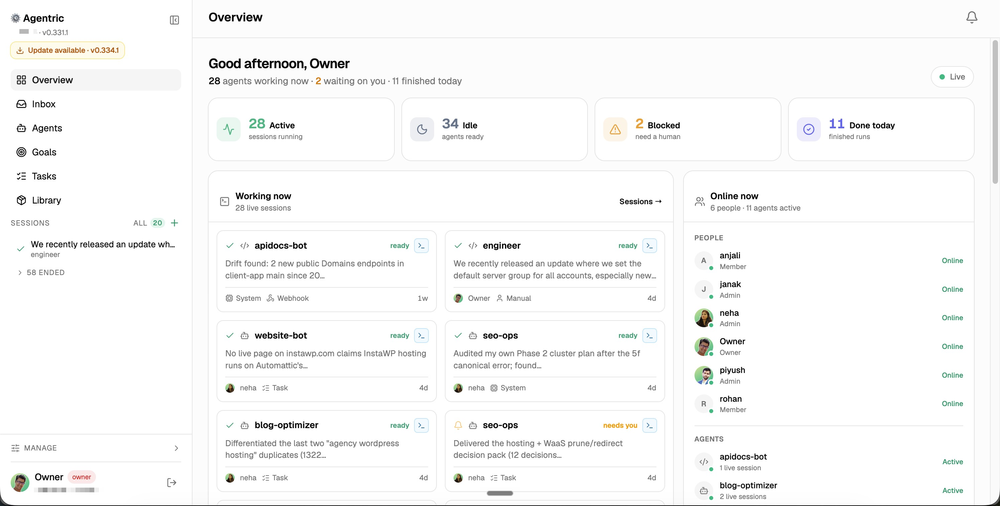
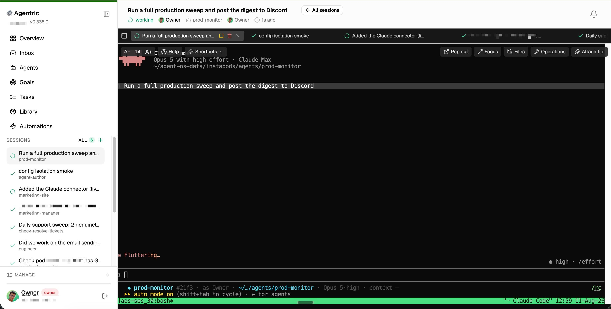

<div align="center">

# Agentric

### Run AI agents unattended, without handing them the keys to everything.

Agentric is a self-hosted control plane for AI agents. Give an agent a job and walk away. Every action
it takes in the real world goes through one gate you control, where risky moves pause for your
approval, budgets are enforced, and everything is written to an append-only audit log.

[agentric.io](https://agentric.io)

[Quickstart](#quickstart) · [How it works](#the-one-rule) · [Features](#features) · [Docs](#documentation)


<br>



<sub>The Overview: every running agent, what finished, and what is waiting on you.</sub>

</div>

---

## Why it exists

Letting an AI agent run on its own is easy. Letting it run on its own safely is the hard part. Today
that means babysitting a terminal and hoping the agent does not run `rm -rf`, refund the wrong
customer, or burn your API budget at 3am.

Agentric puts a governed boundary between your agents and the outside world, then wraps it in a web
console you can run a team from.

- You can leave agents running. Risky actions suspend and wait for a human, and the run resumes the
  moment you approve from your Inbox, Slack, or Discord.
- You stay in control. One policy file, or the in-console editor, decides what is auto-allowed, what
  needs sign-off, and what is forbidden. Budgets stop runaway spend.
- You can see what happened. Every effect lands in an append-only log with the agent's reasoning and
  the result.
- You can run a fleet. Reach any agent by name from Slack or Discord, hand work to a shared task
  queue, and let agents build shared memory and a living knowledge base as they go.

It runs on your laptop with `npm run serve`, and scales to a multi-tenant server behind Tailscale or
nginx.

---

## Quickstart

```bash
git clone https://github.com/vikasprogrammer/agentric
cd agentric
npm install && npm run build
npm run serve          # web console at http://localhost:3010
```

Open http://localhost:3010. On first boot the server prints an owner login link to the console and to
`data/server.log`. Click it and you are in.

To see the governance layer before wiring up any API keys:

```bash
npm run demo           # a scripted run showing approvals, budgets, dedupe and policy denies
```

Running real agents needs [Claude Code](https://claude.com/claude-code) or Codex installed, plus
`tmux` and `ttyd` for the browser terminal (`brew install tmux ttyd`, or your distro's packages).

A note on the name: the product is Agentric, and the plumbing is still called `agent-os`. That covers
the npm package and CLI (`agent-os serve`), the `AGENT_OS_*` env vars, the service units, and the data
home. Running deployments have those names baked in, so they keep them on purpose.

---

## The one rule

Everything in Agentric rests on a single invariant:

> Every side effect an agent has on the outside world passes through one mediated gateway.

That gateway is the whole trust story. Remove it and policies, budgets, and audit logs are just
documentation. Keep it and you can walk away from a running agent.

```
  Agent wants to act  --->  +--------- THE GATEWAY ----------+  --->  the real world
                            |                                |
                            |  1. Classify   green / yellow / red / deny
                            |  2. Approve    pause for a human on risky calls
                            |  3. Budget     hard-stop if over the cap
                            |  4. Identity   act as the run's principal
                            |  5. Dedupe     retried effects fire exactly once
                            |  6. Execute    actually call the capability
                            |  7. Audit      record action, reasoning and result
                            +--------------------------------+
```

When an agent tries something risky, such as `rm`, a deploy, a Stripe refund, or anything touching
production, the gateway pauses the run and drops an approval card in your Inbox. It also DMs whoever
can approve it. You approve or reject, and the run picks up where it left off.

The same gate covers real CLI agents. A Claude Code or Codex session runs inside the agent's own
folder with a `PreToolUse` hook wired in, so every shell command and every MCP tool call is classified
by the same policy engine that governs native capabilities.

<div align="center">



<sub>A live session in the browser terminal. Every run is a real CLI agent in a tmux pane you can
watch, take over, and hand back.</sub>

</div>

---

## Features

### Governance and trust

| Feature | What it does |
|---|---|
| Mediated gateway | One boundary for every effect: classify, approve, budget, identity, dedupe, execute, audit. Native capabilities and CLI agent tool calls both pass through it. |
| Policy engine | JSON rules matched by capability glob plus argument conditions (`amountUsd > 1000`), first match wins. Risk classes are green, yellow, red, and deny. Edited in the console, hot-reloaded into running sessions, persisted to your data home. |
| Human-in-the-loop approvals | A risky call suspends the run until a person answers, from the Inbox, Slack, or Discord. Owners can answer "Always approve", which appends a durable allow rule after every deny rule, so guardrails survive. |
| Policy history and proposals | Every applied policy edit snapshots a revision you can revert in one click. Agents can propose tightening-only changes (`policy_propose`); loosening, hard-deny edits, and new allow rules are refused by construction, and an owner still has to approve. |
| Budgets | Per-run dollar and token caps that stop an agent before it overspends. Media and model calls are cost-metered as they go. |
| Audit trail | Append-only JSONL per run is the system of record, mirrored into SQLite for queries, and browsable in the console Audit page with filters for session, event type, and principal. |
| File-write guard | Enforced in the engine, not only in JSON: crown-jewel paths are always denied, and writes outside the working directory can be routed to approval. |
| Secrets vault | AES-256-GCM at rest with a workspace master key. Connectors resolve `secret:KEY` references at launch, agents get values as shell env vars, and agents can request a credential they lack without a value ever reaching the transcript. |
| Identity and run-as | A session records who triggered it and which person it acts as. Chat-triggered runs act as the sender, and a linked GitHub account means commits and PRs are authored by the real human. |
| Teams and roles | Magic-link login, owner, admin and member roles, per-agent assignment, and approval levels that map to real people. Self-service login recovery is rate-limited and never reveals whether an email is a member. |

### Running agents

| Feature | What it does |
|---|---|
| Agents are folders | An agent is a directory with an `agent.json` manifest and a `CLAUDE.md` system prompt. Create, edit, and delete them from the console or with the CLI. |
| Two real runtimes | Claude Code and Codex, both governed by the same gate hook. Call sites probe declared runtime capabilities instead of comparing runtime ids, so a runtime that lacks attach or resident chat degrades cleanly. |
| Browser terminal | Sessions are tmux panes served over ttyd inside the console, gated by the same login. You can watch a live run, take it over losslessly, and hand it back. |
| Headless and interactive lanes | Unattended runs are still attachable TUIs, closed by the server at turn end unless a human took over or the run is blocked on a person. Interactive runs stay live until closed. |
| Per-agent runtime tuning | Model, effort, permission mode, and output verbosity resolve from the agent manifest, then a workspace default, then the CLI default. Verbosity compresses narration while leaving reports, memories, and other durable output alone. |
| Session lifecycle | Status comes from Claude Code hooks rather than guesswork, so the console can tell running from blocked from rate-limited from crashed, and reap what died. |
| Hand-off chains | Runs fold into conversations by transcript, and conversations nest under the caller that delegated them. A chain rail beside the terminal shows the tree and answers a delegate's pending question in place. |
| Self-improving agents | An agent edits its own listing and prompt (`agent_update`), reads any agent's config (`agent_get`), and reverts a bad self-edit. Cross-agent edits are routed by the proposer's maturity: refused, human-approved, or auto-applied at the top tier, always revertable. |
| Trust and maturity | Per-agent stats combine autonomy, denial rate, human ratings, and volume confidence into a maturity score that gates what an agent is allowed to propose. |

### Work: goals, tasks, automations

| Feature | What it does |
|---|---|
| Goals | The strategic layer above tasks. Agents read goals, propose new ones as drafts, and link tasks to them; progress is derived from the linked tasks. |
| Shared task queue | A Kanban backlog humans and agents drain together, with status, priority, labels, assignee, owner, due dates, dependencies, and an append-only activity log. |
| Agent to agent delegation | Assign a task to an agent and it auto-dispatches a governed session. `task_wait` makes the hand-off synchronous, poke-back resumes the caller's transcript when the delegate finishes, and `ask_agent` is a short synchronous question with no board entry. |
| Task discussion | A threaded conversation on a task. `@mentions` reach a person by DM or resume an agent on that task, and a human's reply is typed into the live run working it. |
| Automations | Cron, webhook, Slack, and Discord triggers spawn governed sessions unattended, running as the person who triggered them, with a pile-up guard so a slow run is not stacked on. |
| Scheduled self-runs | An agent defers a future run of itself with `schedule`, bounded to between one minute and thirty days and cancellable by a human. |
| Inbox | One feed for approvals, questions, progress updates, completions, and proposals. Read and dismiss state is per member, and cards addressed to a person also arrive as a DM. |
| Ask a human | `ask_human` blocks the run until someone answers, either in the console or by replying to the Slack or Discord DM. Optionally it targets a specific teammate instead of the run's operator. |
| Library | Agents publish finished deliverables (Markdown, PDF, images, video) into a governed gallery. Files are snapshotted on publish, scoped by provenance, and previewed in the console. |
| Apps | Small server-side apps built by humans or agents, running as supervised child processes behind the login-gated proxy, with default-deny capabilities, secrets, scale-to-zero, and optional custom domains. |

### Knowledge and learning

| Feature | What it does |
|---|---|
| Memory | Per-agent and workspace-shared `remember` and `recall`, with `revise` and `forget` for self-correction. Three backends (SQLite, libSQL vectors, automem) switch live in Settings. |
| Recall quality | FTS5 keyword search, optional hybrid semantic recall through OpenAI-compatible or local Ollama embeddings, recency and importance re-ranking, retrieval reinforcement, and scheduled prune plus dedupe. |
| Episodic self-query | An agent lists its own past runs and reopens one as a timeline or a recap, so it can answer "have I done this before" from the run history rather than guessing. |
| Knowledge base | A tenant-wide living wiki agents and humans co-author, stored as markdown on disk with an FTS mirror. Every write snapshots a revision, so any edit is revertable instead of gated. |
| Skills | A global library in Claude Code's native `.claude/skills` format, synced into agents at launch and scoped per agent. Import from a bundled catalog, any public GitHub repo, the skills.sh directory, or a zip. |
| Agent-requested skills | Agents discover skills with `skill_find` and ask for one with `skill_request`. They never install a skill themselves; an owner or admin does, and an approved skill lands in a live session immediately. |
| Procedural memory | Agents draft their own playbooks with `skill_propose`. A proposal stays invisible to the fleet until a human publishes it. |
| Insights and self-learning | A periodic reflect pass compounds recent episodes, outcomes, and friction into cumulative state, renders a living KB page, injects distilled guidance into agent prompts, and proposes config changes for a human to apply or dismiss. |
| Measurement | Before and after success rates per applied intervention, with an explicit verdict and sample size, withheld below a minimum sample. It is correlational and says so. |
| Company context | One markdown document appended to every agent's system prompt, so shared conventions live in one place instead of in every `CLAUDE.md`. |

### Integrations

| Feature | What it does |
|---|---|
| Slack, native | One company app over Socket Mode, so a private box with outbound access works with no public URL. Mentions and DMs fire automations as the sending member, and threads keep context across replies. |
| Discord, native | The same path over the Discord Gateway, including a real thread branched off a guild mention. |
| Chat router | A message that matches no automation still reaches the fleet: address any agent by name (`/pod-troubleshooter why is pod X down`) and it spawns a governed one-off run that replies in the thread. |
| Proactive chat egress | Agents post to any channel or DM any person on Slack and Discord, off-thread and unattended, audited rather than gated. |
| MCP connectors | A catalog of stdio and remote MCP servers materialised into each session's `.mcp.json`. Every connector call is classified by the gate, with mutation verbs routed to approval. |
| Composio | One remote connector fronting 850 or more apps, with a fresh pre-signed session URL minted per launch and scoped to the acting member. |
| GitHub per member | A member links their own GitHub account and their token overrides the bot's for their runs, so git history shows the person, not a shared bot. Agents recover a stale token mid-run with `github_refresh`. |
| Media | Image generation and editing (prompt edit, upscale, background removal), text-to-video and image-to-video with an async job model, and video understanding. Outputs land in the Library, cost-metered and audited. |

### Operations

| Feature | What it does |
|---|---|
| Zero runtime dependencies | A plain Node HTTP server, Node's built-in `node:sqlite`, and no database service to install. One SQLite file per data home holds everything the console touches. |
| Software and data are separate | This repo is the software. Your agents, policy, audit log, and state live in a configurable data home that can be its own private repo. |
| Multi-tenancy | Run one process per tenant, or many tenants in one process routed by subdomain, with the DB file as the tenant boundary either way. |
| Self-hosted anywhere | macOS or Linux, on a laptop, a Mac Mini behind Tailscale, or a hardened systemd box behind nginx. Optional per-user OS isolation on Linux uses systemd DynamicUser and slices. |
| Console surfaces | Overview, Inbox, Agents, Sessions, Cockpit, Chat, Goals, Tasks, Library, Automations, Knowledge, Memory, Insights, Skills, Apps, Connections, Team, Files, Audit, and Settings. |

Pillar-by-pillar implementation status, including the gaps, is in [`docs/PILLARS.md`](docs/PILLARS.md).
The full list of tools agents can call is in [`docs/agent-mcp-tools.md`](docs/agent-mcp-tools.md).

---

## Humans and agents on the same team

Agentric is not a fire-and-forget bot runner. Agents and people share one task queue, one knowledge
base, and one approval loop, so work moves back and forth instead of over a wall.

- Assign a task to an agent and it dispatches a governed session, then closes its own ticket.
- Agents and teammates co-author the same wiki, and every edit is versioned and revertable.
- An agent that hits something risky pauses and asks instead of guessing, and you decide.
- An agent can delegate to another agent while the accountable human stays attached to the whole
  chain.

---

## How it works

Each agent is a directory with an `agent.json` manifest and a `CLAUDE.md` system prompt. Point it at
the `claude-code` runtime and Agentric opens a real Claude session inside that folder, with the
`PreToolUse` gate hook wired in.

This repo is the software. Your agents, policies, and runtime state are your data, and they live in a
separate data home you configure. Keep that home in its own private repo and you can contribute to the
open-source software without ever committing your agents.

```
agent-os/                        # the software (this repo, where you contribute)
  src/  web/  terminal/          #   kernel, gateway, console, session runners
  config/agents/example-*/       #   bundled example agents

$AGENT_OS_HOME  (default ./data, can be its own private repo)
  agents/<id>/                   #   your agent is one folder
    agent.json  CLAUDE.md        #     definition
    .claude/  memory/            #     runtime state the agent writes
  policy/default.policy.json     #   your policy (optional override)
  audit/  agent-os.db  tmux.sock #   audit log, SQLite state, live sessions
```

Scaffold your own home and run it:

```bash
agent-os init ./my-brand
AGENT_OS_HOME=./my-brand agent-os serve --port=3010
```

One home plus one port is one isolated instance. Run several side by side, or fan out to many tenants.
See [`docs/scoping-model.md`](docs/scoping-model.md).

---

## Extending it

To add a capability, implement `Capability` and register it. The gateway governs it automatically and
the policy file decides its risk.

```ts
const sendInvoice: Capability = {
  id: 'billing.sendInvoice',
  description: 'Email an invoice to a customer',
  defaultRisk: 'yellow',
  estimateCost: () => ({ usd: 0.002, tokens: 0 }),
  async invoke(args, ctx) {
    const key = await ctx.secrets.get(ctx.run.tenant, ctx.run.principal, 'BILLING_API_KEY');
    // ... perform the effect ...
    return { ok: true, data: { invoiceId: 'inv_123' } };
  },
};
os.registerCapabilities([sendInvoice]);
```

To change policy without touching code, edit the JSON. First match wins, so put the specific rule
first:

```jsonc
{ "match": { "capability": "billing.sendInvoice", "when": { "arg": "amountUsd", "op": "gt", "value": 500 } }, "risk": "red" },
{ "match": { "capability": "billing.sendInvoice" }, "risk": "yellow" }
```

---

## Deployment

- Local or self-hosted on macOS or Linux: `npm run serve` runs a single Node process fronting the app,
  the API, and the browser terminal. Put it behind Tailscale or nginx for HTTPS. The built-in cookie
  login gates everything, so you do not need extra basic auth.
- Production on Linux with systemd: the bundled [`agent-os.service`](agent-os.service) is configured so
  agent sessions survive a restart. Several nginx and systemd traps will bite anyone hand-rolling a
  unit, and they are documented with fixes in [`CLAUDE.md`](CLAUDE.md).
- Multi-tenant: a process per tenant ([`docs/process-per-tenant.md`](docs/process-per-tenant.md)), or
  many tenants in one process routed by subdomain ([`docs/scoping-model.md`](docs/scoping-model.md)).

---

## The status line, on any machine

Agentric renders a status line at the bottom of every governed agent TUI: branch or agent id, folder,
model and effort, a context-window meter, weekly usage, cost, diff churn — and the two things only
Agentric knows, the human identity the run acts as and how many approvals it is blocked on.

The same renderer works in a plain `claude` session that Agentric never launched. One command, no
checkout and no npm install:

```bash
curl -fsSL https://raw.githubusercontent.com/vikasprogrammer/agentric/main/scripts/install-statusline.sh | bash
```

It copies the renderer into your claude config dir (`$CLAUDE_CONFIG_DIR`, default `~/.claude`) and
points `settings.json` → `statusLine` at it, leaving every other key alone and backing the file up
first. Outside Agentric there is no session to ask about, so the governance half stays silent and the
head of the bar carries the git branch instead. To undo — it restores whatever status line you had
before:

```bash
curl -fsSL https://raw.githubusercontent.com/vikasprogrammer/agentric/main/scripts/install-statusline.sh | bash -s -- --uninstall
```

---

## Documentation

| Doc | What is in it |
|---|---|
| [`web/src/docs/use-cases.md`](web/src/docs/use-cases.md) | What to automate first — proven agent shapes, triggers, and safety postures (also in the console under **Docs → Use cases**) |
| [`docs/ARCHITECTURE.md`](docs/ARCHITECTURE.md) | The design rationale and the gateway spine |
| [`docs/PILLARS.md`](docs/PILLARS.md) | Every product pillar and its real implementation status |
| [`docs/governance-model.md`](docs/governance-model.md) | Policy, approvals, budgets, identity |
| [`docs/agent-mcp-tools.md`](docs/agent-mcp-tools.md) | Every tool agents can call, with its route and governance notes |
| [`docs/memory-model.md`](docs/memory-model.md) | How agents capture, recall, distil, and apply what they learn |
| [`docs/tasks-plan.md`](docs/tasks-plan.md) | The task queue, dispatch, and delegation model |
| [`docs/codex-runtime.md`](docs/codex-runtime.md) | Running Codex under the same invariant |
| [`docs/process-per-tenant.md`](docs/process-per-tenant.md) | Running multiple isolated tenants |
| [`CLAUDE.md`](CLAUDE.md) | Build and run notes plus the production deployment runbook |

---

## License

[MIT](LICENSE). The mechanisms (kernel, gateway, governance, console) are open and yours to build on.
